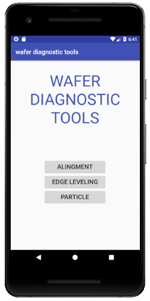
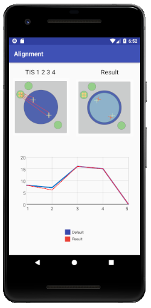
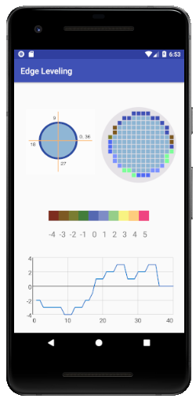
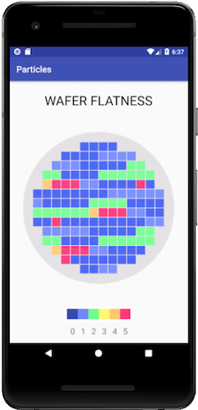

# # wafer-diagnostic-tools

### - It is a tool that helps check wafers condition before it to be microchips. 

### - Alignment, Edge Leveling, Particle check

### 

### 0. Main

```
- shows 3 test options
```



### 1. Alignment

```
- check if a wafer is located at the expected position
- by using TIS 1,2,3,4 sensor, it can figure out wafers position
- possible results : 
	- rotate clock wise, count clock wise 
	- shift E,S,S,N
- How to read result 
 	- blue line : defalt distance between each TIS and align mark
 	- red line : real reading value
```

###  




### 2. Leveling 

```
- check wafer is parlelly located
- normal value is 0
```

###  




### 3. Particle

```
- wafers always should be super clean, check if wafers are contaminated
- color show how wafers contaminated
```

###  




